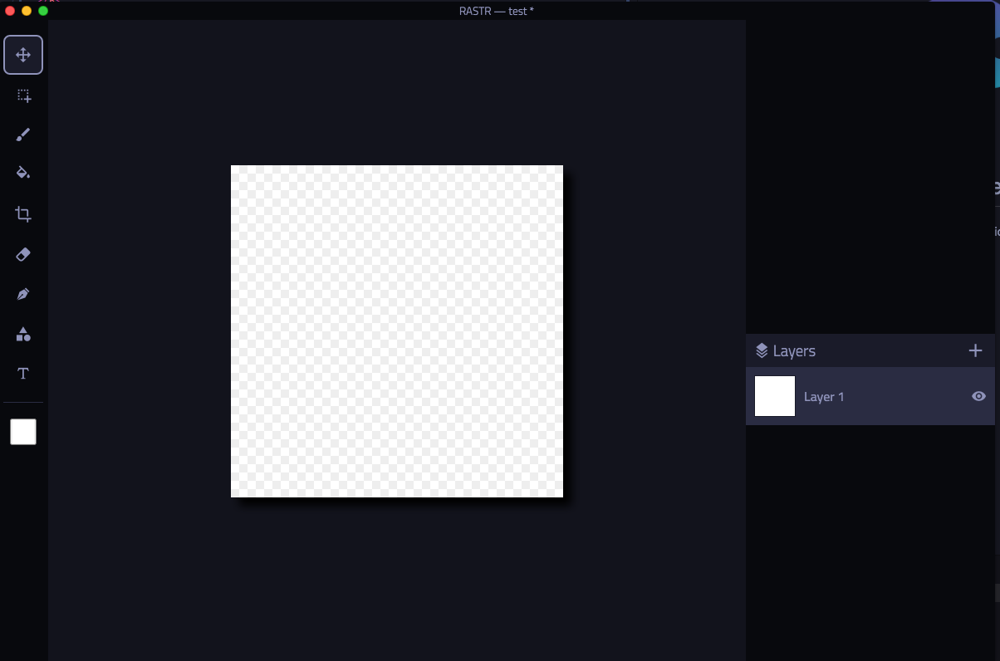

    

<h1 align="center">
RASTR | Canvas-based Photo Editor
</h1>

RASTR is a cross-platform desktop photo editor and graphic design application written in JavaScript and based on the HTML5 canvas element.

## Performance
As is the nature with HTML5 canvas, it's not exactly quick. My goal is to eventually port the core image processing code over to either C++ or Rust (if I've bothered to learn Rust by then). My goal with this was to build a nice set of tools and handle image processing in a manner that doesn't require decoding of every possible image format separately. In that respect, I think this project is serving it's purpose.

Some other ideas include using WebGL or WebAssembly for the CPU-intensive bits. Another option is to utilize a library like GPU.js to allow parallel processing on the GPU for the heavy parts. Both options would allow me to retain the Electron-based UI which I'm certainly in favor of.

## Building
If you're brave enough, you can clone the repo and install the NPM packages. There is currently no build script in place to create a binary but you can run `npm run electron:serve` to launch the app in developer mode. This section will be updated as the relevant config is changed.